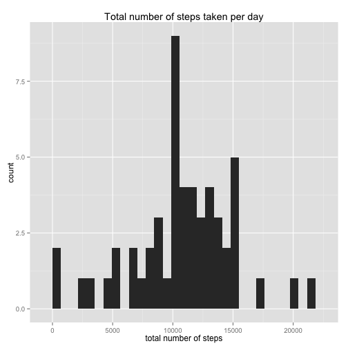
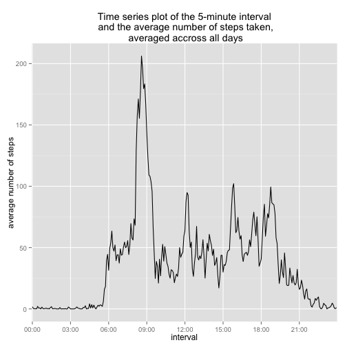
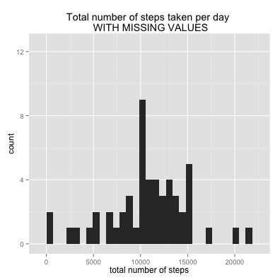
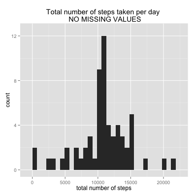
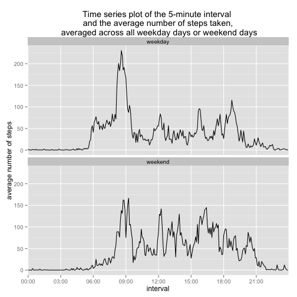

# Reproducible Research: Peer Assessment 1

## Loading and preprocessing the data

```r
df <- read.csv(unz("activity.zip", "activity.csv"))
dim(df)
```

```
## [1] 17568     3
```

```r
str(df)
```

```
## 'data.frame':	17568 obs. of  3 variables:
##  $ steps   : int  NA NA NA NA NA NA NA NA NA NA ...
##  $ date    : Factor w/ 61 levels "2012-10-01","2012-10-02",..: 1 1 1 1 1 1 1 1 1 1 ...
##  $ interval: int  0 5 10 15 20 25 30 35 40 45 ...
```

```r

# transform the column 'date' to a date class format
df$date <- as.Date(df$date)
summary(df)
```

```
##      steps            date               interval   
##  Min.   :  0.0   Min.   :2012-10-01   Min.   :   0  
##  1st Qu.:  0.0   1st Qu.:2012-10-16   1st Qu.: 589  
##  Median :  0.0   Median :2012-10-31   Median :1178  
##  Mean   : 37.4   Mean   :2012-10-31   Mean   :1178  
##  3rd Qu.: 12.0   3rd Qu.:2012-11-15   3rd Qu.:1766  
##  Max.   :806.0   Max.   :2012-11-30   Max.   :2355  
##  NA's   :2304
```

```r
head(df)
```

```
##   steps       date interval
## 1    NA 2012-10-01        0
## 2    NA 2012-10-01        5
## 3    NA 2012-10-01       10
## 4    NA 2012-10-01       15
## 5    NA 2012-10-01       20
## 6    NA 2012-10-01       25
```


## What is mean total number of steps taken per day?
### 1. Make a histogram of the total number of steps taken each day

```r
# prepare the data
daily.steps <- na.omit(as.data.frame.table(tapply(df$steps, df$date, sum)))
colnames(daily.steps) <- c("date", "total.steps")
dim(daily.steps)
```

```
## [1] 53  2
```

```r
summary(daily.steps)
```

```
##          date     total.steps   
##  2012-10-02: 1   Min.   :   41  
##  2012-10-03: 1   1st Qu.: 8841  
##  2012-10-04: 1   Median :10765  
##  2012-10-05: 1   Mean   :10766  
##  2012-10-06: 1   3rd Qu.:13294  
##  2012-10-07: 1   Max.   :21194  
##  (Other)   :47
```

```r
head(daily.steps)
```

```
##         date total.steps
## 2 2012-10-02         126
## 3 2012-10-03       11352
## 4 2012-10-04       12116
## 5 2012-10-05       13294
## 6 2012-10-06       15420
## 7 2012-10-07       11015
```

```r

# plot the data
library(ggplot2)
ggplot(daily.steps, aes(total.steps)) + geom_histogram() + labs(x = "total number of steps") + 
    labs(title = "Total number of steps taken per day")
```

```
## stat_bin: binwidth defaulted to range/30. Use 'binwidth = x' to adjust this.
```

 


### 2. Calculate and report the mean and median total number of steps taken per day

```r
## Mean total number of steps taken per day
mean(daily.steps$total.steps)
```

```
## [1] 10766
```

```r

## Median total number of steps taken per day
median(daily.steps$total.steps)
```

```
## [1] 10765
```


## What is the average daily activity pattern?
### 1. Make a time series plot (i.e. type = "l") of the 5-minute interval (x-axis) and the average number of steps taken, averaged across all days (y-axis)


```r
# prepare the data
mean.steps.by.interval <- as.data.frame.table(tapply(df$steps, df$interval, 
    mean, na.rm = TRUE))
colnames(mean.steps.by.interval) <- c("interval", "mean.steps")
dim(mean.steps.by.interval)
```

```
## [1] 288   2
```

```r
head(mean.steps.by.interval)
```

```
##   interval mean.steps
## 1        0    1.71698
## 2        5    0.33962
## 3       10    0.13208
## 4       15    0.15094
## 5       20    0.07547
## 6       25    2.09434
```

```r

# plot the data
ggplot(mean.steps.by.interval, aes(interval, mean.steps)) + geom_line(aes(group = 1)) + 
    scale_x_discrete(breaks = seq(0, 2355, by = 300), labels = c("00:00", "03:00", 
        "06:00", "09:00", "12:00", "15:00", "18:00", "21:00")) + labs(x = "interval") + 
    labs(y = "average number of steps") + labs(title = "Time series plot of the 5-minute interval\n and the average number of steps taken,\n averaged accross all days")
```

 


### 2. Which 5-minute interval, on average across all the days in the dataset, contains the maximum number of steps?
The above graph suggests that, on average, the 5-minute interval that contains the maximum number of steps is somewhere around 850 with an average number of steps of slightly above 200.

This can be formally checked with the following code:

```r
mean.steps.by.interval[which.max(mean.steps.by.interval$mean.steps), ]
```

```
##     interval mean.steps
## 104      835      206.2
```


## Imputing missing values
### 1. Calculate and report the total number of missing values in the dataset (i.e. the total number of rows with NAs)


```r
nrow(df[!complete.cases(df), ])
```

```
## [1] 2304
```


### 2. Devise a strategy for filling in all of the missing values in the dataset. The strategy does not need to be sophisticated. For example, you could use the mean/median for that day, or the mean for that 5-minute interval, etc.
> I choose to fill in all of the missing values with the mean of the 5-minute interval, which I computed above and stored in the "mean.steps.by.interval" dataframe. My procedure is to create two subsets of the main dataframe (i.e. df), one with missing values, the other one without missing values. Then, I replace the missing values (in the dataframe that contains all missing values) with the mean for the 5-minute interval. Finally, I concatenate both subsets of df to create a new dataframe (df.complete) with the missing values properly replaced (see 3.).


```r
# subset of df without missing values
df.complete <- df[complete.cases(df), ]
dim(df.complete)
```

```
## [1] 15264     3
```

```r
nrow(df.complete[!complete.cases(df.complete), ])  # check that there are zero rows with missing values
```

```
## [1] 0
```

```r

# subset of df with missing values
df.miss.val <- df[!complete.cases(df), ]
dim(df.miss.val)
```

```
## [1] 2304    3
```

```r
nrow(df.miss.val[!complete.cases(df.miss.val), ])  # check all of the rows have missing values
```

```
## [1] 2304
```

```r

# replace missing values by the mean for th e5-minute interval
merged <- merge(df.miss.val, mean.steps.by.interval, by.x = "interval")
merged <- merged[, c(4, 3, 1)]
colnames(merged) <- c("steps", "date", "interval")
head(merged)
```

```
##   steps       date interval
## 1 1.717 2012-10-01        0
## 2 1.717 2012-11-30        0
## 3 1.717 2012-11-04        0
## 4 1.717 2012-11-09        0
## 5 1.717 2012-11-14        0
## 6 1.717 2012-11-10        0
```


### 3. Create a new dataset that is equal to the original dataset but with the missing data filled in.

```r
# new data set with no missing values
df.complete <- rbind(df.complete, merged)
df.complete$date <- as.Date(df.complete$date)
dim(df.complete)
```

```
## [1] 17568     3
```

```r
nrow(df.complete[!complete.cases(df.complete), ])  # check that there are no missing values
```

```
## [1] 0
```

```r
head(df.complete)
```

```
##     steps       date interval
## 289     0 2012-10-02        0
## 290     0 2012-10-02        5
## 291     0 2012-10-02       10
## 292     0 2012-10-02       15
## 293     0 2012-10-02       20
## 294     0 2012-10-02       25
```


### 4. Make a histogram of the total number of steps taken each day. Calculate and report the mean and median total number of steps taken per day. Do these values differ from the estimates from the first part of the assignment? What is the impact of imputing missing data on the estimates of the total daily number of steps?

```r
# prepare the data
daily.steps.complete <- as.data.frame.table(tapply(df.complete$steps, df.complete$date, 
    sum))
colnames(daily.steps.complete) <- c("date", "total.steps")
dim(daily.steps.complete)
```

```
## [1] 61  2
```

```r
head(daily.steps.complete)
```

```
##         date total.steps
## 1 2012-10-01       10766
## 2 2012-10-02         126
## 3 2012-10-03       11352
## 4 2012-10-04       12116
## 5 2012-10-05       13294
## 6 2012-10-06       15420
```

> To answer to the above question,let's visualize the two histograms side by side. The left plot represents the histogram of the total number of steps taken each day with the missing values (same histogram as the one in the first part of the project). The right plot is the histogram of the total number of steps taken each day without the missing values. Note that I re-scaled both histograms to be on the same y-axis range for better comparison.


```r
# plot the data - with missing values
library(ggplot2)
ggplot(daily.steps, aes(total.steps)) + geom_histogram() + scale_y_continuous(limits = c(0, 
    12.5)) + labs(x = "total number of steps") + labs(title = "Total number of steps taken per day \n WITH MISSING VALUES")
```

```
## stat_bin: binwidth defaulted to range/30. Use 'binwidth = x' to adjust this.
```

```r

# plot the data - without missing values
library(ggplot2)
ggplot(daily.steps.complete, aes(total.steps)) + geom_histogram() + scale_y_continuous(limits = c(0, 
    12.5)) + labs(x = "total number of steps") + labs(title = "Total number of steps taken per day \n NO MISSING VALUES")
```

```
## stat_bin: binwidth defaulted to range/30. Use 'binwidth = x' to adjust this.
```

  

> The shape of both histograms is roughtly similar. However, the range values for the count differs. It varies between 0 and about 9 for the histogram with missing values (i.e. left plot), whereas the count values for the histogram without missing values (right plot) vary between 0 and about 12. It is also worth noticing that the maximum values differ, and correspond to 9 and 12 for the left and right histograms, respectively. Moreover, the total number of steps reaches its maximum 10,000 steps for the left plot, but is approaximately at 11,000 steps for the right plot. Therefore , imputing missing data on the estimates of the total daily number of steps impacts counts as well as maximum values in this specific case.  

## Are there differences in activity patterns between weekdays and weekends?
### 1. Create a new factor variable in the dataset with two levels – “weekday” and “weekend” indicating whether a given date is a weekday or weekend day.

```r
# create a 'day' column indicating the day of the week
df.complete$day <- as.factor(weekdays(df.complete$date))
head(df.complete)
```

```
##     steps       date interval     day
## 289     0 2012-10-02        0 Tuesday
## 290     0 2012-10-02        5 Tuesday
## 291     0 2012-10-02       10 Tuesday
## 292     0 2012-10-02       15 Tuesday
## 293     0 2012-10-02       20 Tuesday
## 294     0 2012-10-02       25 Tuesday
```

```r

# create a 'week' column indicating weekday or weekend
df.complete$week <- ifelse((df.complete$day == "Saturday" | df.complete$day == 
    "Sunday"), "weekend", "weekday")
df.complete$week <- as.factor(df.complete$week)  # create two levels
head(df.complete)
```

```
##     steps       date interval     day    week
## 289     0 2012-10-02        0 Tuesday weekday
## 290     0 2012-10-02        5 Tuesday weekday
## 291     0 2012-10-02       10 Tuesday weekday
## 292     0 2012-10-02       15 Tuesday weekday
## 293     0 2012-10-02       20 Tuesday weekday
## 294     0 2012-10-02       25 Tuesday weekday
```

```r
str(df.complete)
```

```
## 'data.frame':	17568 obs. of  5 variables:
##  $ steps   : num  0 0 0 0 0 0 0 0 0 0 ...
##  $ date    : Date, format: "2012-10-02" "2012-10-02" ...
##  $ interval: int  0 5 10 15 20 25 30 35 40 45 ...
##  $ day     : Factor w/ 7 levels "Friday","Monday",..: 6 6 6 6 6 6 6 6 6 6 ...
##  $ week    : Factor w/ 2 levels "weekday","weekend": 1 1 1 1 1 1 1 1 1 1 ...
```


### 2. Make a panel plot containing a time series plot (i.e. type = "l") of the 5-minute interval (x-axis) and the average number of steps taken, averaged across all weekday days or weekend days (y-axis).


```r
# subset of weekday and computation of the average number of steps taken
weekday <- df.complete[df.complete$week == "weekday", ]
panel.weekday <- as.data.frame.table(tapply(weekday$steps, weekday$interval, 
    mean))
colnames(panel.weekday) <- c("interval", "mean.steps")
# panel.weekday$interval <- as.character(panel.weekday$interval)
panel.weekday$week <- "weekday"  # add a column
dim(panel.weekday)
```

```
## [1] 288   3
```

```r
head(panel.weekday)
```

```
##   interval mean.steps    week
## 1        0    2.25115 weekday
## 2        5    0.44528 weekday
## 3       10    0.17317 weekday
## 4       15    0.19790 weekday
## 5       20    0.09895 weekday
## 6       25    1.59036 weekday
```

```r

# subset of weekend and computation of the average number of steps taken
weekend <- df.complete[df.complete$week == "weekend", ]
panel.weekend <- as.data.frame.table(tapply(weekend$steps, weekend$interval, 
    mean))
colnames(panel.weekend) <- c("interval", "mean.steps")
panel.weekend$week <- "weekend"  # add a column
dim(panel.weekend)
```

```
## [1] 288   3
```

```r
head(panel.weekend)
```

```
##   interval mean.steps    week
## 1        0   0.214623 weekend
## 2        5   0.042453 weekend
## 3       10   0.016509 weekend
## 4       15   0.018868 weekend
## 5       20   0.009434 weekend
## 6       25   3.511792 weekend
```

```r

# concatenate panel.weekday and panel.weekend into one dataset
panel.data <- rbind(panel.weekday, panel.weekend)
panel.data$week <- as.factor(panel.data$week)
dim(panel.data)
```

```
## [1] 576   3
```

```r
head(panel.data)
```

```
##   interval mean.steps    week
## 1        0    2.25115 weekday
## 2        5    0.44528 weekday
## 3       10    0.17317 weekday
## 4       15    0.19790 weekday
## 5       20    0.09895 weekday
## 6       25    1.59036 weekday
```

```r
tail(panel.data)
```

```
##     interval mean.steps    week
## 571     2330     1.3880 weekend
## 572     2335    11.5873 weekend
## 573     2340     6.2877 weekend
## 574     2345     1.7052 weekend
## 575     2350     0.0283 weekend
## 576     2355     0.1344 weekend
```

```r

# plot the data (using ggplot)
ggplot(panel.data, aes(interval, mean.steps)) + geom_line(aes(group = 1)) + 
    facet_wrap(~week, nrow = 2, ncol = 1) + scale_x_discrete(breaks = seq(0, 
    2355, by = 300), labels = c("00:00", "03:00", "06:00", "09:00", "12:00", 
    "15:00", "18:00", "21:00")) + labs(x = "interval") + labs(y = "average number of steps") + 
    labs(title = "Time series plot of the 5-minute interval \n and the average number of steps taken, \n averaged across all weekday days or weekend days")
```

 


